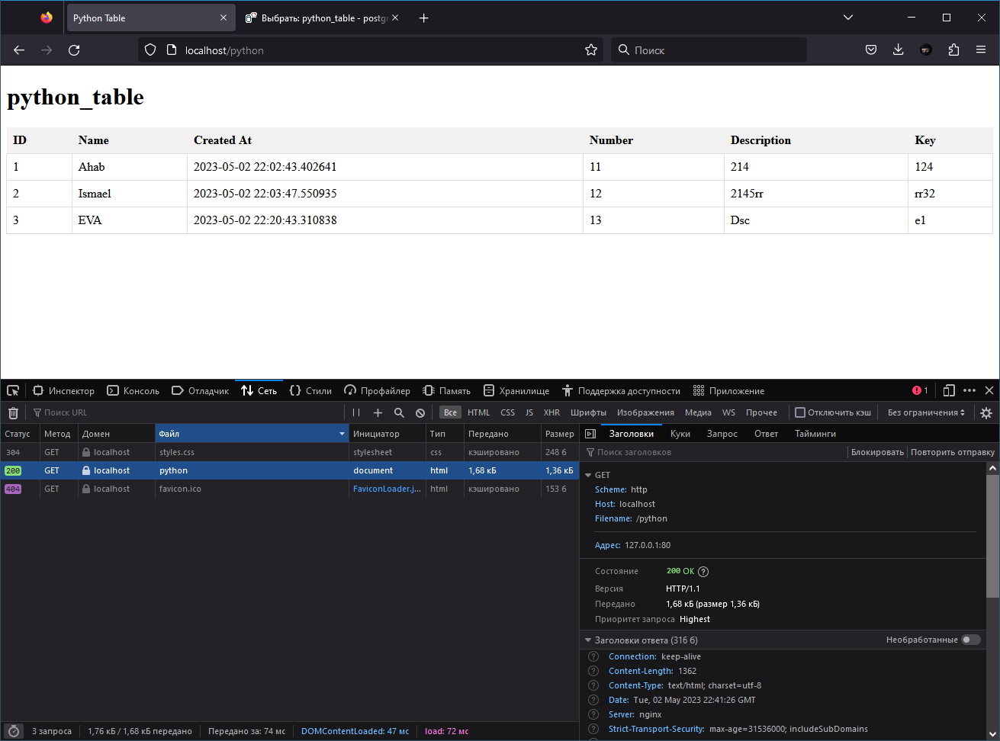

# DOCKER BOX

```
nginx, apache, php, .net, python, nodejs, adminer, certbot, mysql, mariadb, postgres, certbot
```

Available now:
- Nginx
- Apache
- PHP
- Adminer
- Postgres
- Python
- nodejs 
- mariadb 

## NGINX

Nginx

http://localhost/

http://localhost/apache

http://localhost/adminer

http://localhost/python

## APACHE

Apache httpd

## PHP 

PHP7.4

## ADMINER

Adminer 

Оформление:
```
    environment:
      ADMINER_DESIGN: pepa-linha-dark
```

## POSTGRES SQL

PosgresSQL
```
CREATE TABLE mytable (
  id SERIAL PRIMARY KEY,
  name VARCHAR(255) NOT NULL,
  created_at TIMESTAMP NOT NULL,
  number VARCHAR(6) NOT NULL,
  description VARCHAR(10) NOT NULL,
  key VARCHAR(25) NOT NULL
);
```

## PYTHON 



`app_html.py` - рендерит страницу, выводит записи из БД

`app_delete_frome_tb.py` - удаляет все записи в БД (id остаётся!)

`app_wright_table.py` - записывает в таблицу БД, сам создаёт данные для каждого имени из `names`

## NODE JS 


`index.js` - рендерит страницу, выводит записи из БД

```
    command: >
      sh -c "cd /app && node index.js"
    # sh -c "cd /app && npm install mysql express faker && node index.js"
    # для первого запуска
```

## MARIA DB 

```
CREATE TABLE IF NOT EXISTS my_table (
  id INT AUTO_INCREMENT PRIMARY KEY,
  name VARCHAR(50) NOT NULL,
  created_at TIMESTAMP DEFAULT CURRENT_TIMESTAMP,
  number INT NOT NULL,
  description VARCHAR(100) NOT NULL,
  `key` VARCHAR(25) NOT NULL
);
```